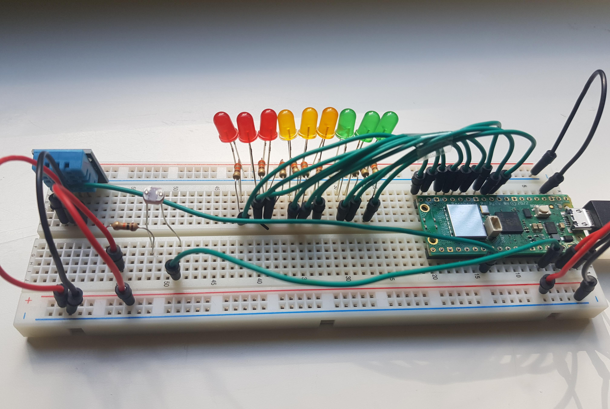

# Machine Learning Solar Irradiance Prediction IoT Application
IoT web application that predicts solar irradiance by using Machine Learning algorithms in Python: Raspberry Pi Pico &amp; OpenWeatherMap API.<br>
**Ivan Hanono Cozzetti, ih222sf**

#### This is a description and tutorial on building a Machine Learning solar irradiance predictor, using real-time data gathered from a Raspberry Pi Pico WH and [OpenWeatherMap](https://openweathermap.org/) API.

The predictions made here are for [Direct Solar Irradiance](https://globalsolaratlas.info/support/faq) (also known as Beam Radiation).<br>
Note that this differs from diffuse solar radiation. This means that the prediction represents the solar irradiance on a direct surface.<br>
Meteorological data was gathered from [HI-SEAS weather station](https://www.hi-seas.org/), which lasted 4 months and was collected from an area in Hawaii with similar conditions to Mars. 

| Raspberry Pi Pico gathered data:  |OpenWeatherMap API data: |
|---|---|
| Humidity | Wind Speed |  
| Temperature | Wind Direction  | 
| Light | Air Pressure |  

In order to predict solar irradiance, the application runs input data read from the Raspberry Pi Pico and the API, through a number of algorithms built on 32.686 rows of data.

*How much time Will take to build this project?*<br>
That will highly depend on the environment and operating system you are using.<br>
If you have worked with Linux before, I highly suggest doing it so in a Linux machine (anything Debian-based should be easy, such as Ubuntu).<br>
Considering that, it should take between 2 to 5 hours to set everything up, depending on your experience working with programming environments, Linux, troubleshooting, and dependencies. 

## Objective
*Why this project?*<br>
The main motivation was to try to build something complex, using Machine Learning, out of simple and available sensors and data.<br>
Although this project is specifically set up to predict solar irradiance, a similar approach and steps could be taken to make other types of predictions: if you have other sensors, and
you are using a different dataset, for example from [Kaggle](https://www.kaggle.com/) (that has more than 350.000 open datasets available), then you could twitch hyperparameters and settings to
make your own predictive method.<br>
This is of course a simplification of the project. If you wish to fully understand what, how, and why, you should learn and understand many complex concepts. However, is a good start, and more importantly **motivating**.

*What's the purpose of this project?* <br>
The main purpose of this project is to predict solar irradiance out of real-time data, from multiple sensors from an RP Pico WH and APIs.<br>
Solar irradiance is not something that anybody measures daily for any unspecific need, but rather a scientific measure (kilowatts/watts per square meter).<br>
So there is no general purpose, however, this could help in both scientific and non-scientific applications:
1. A somehow general application for it could be the set-up and correction of solar panels' directions and angles: <br>
If you own solar panels, and you wish to correct or improve the efficiency of the irradiance over the panels' surface, you can use this IoT approach.<br>
Furthermore, one could automate the panel's angles based on the data fetched and the response from the ML models (which is a key advantage of working with full-duplex transmission).<br>
In practice, a device exists called *Solar Irradiance Meter* to know solar irradiance, however, these are very expensive (anywhere from 400 to 700 U.S. dollars).
2. In the scientific research area, one could use instead a dataset that is based on Diffuse Solar Radiation and set many of these IoT devices throughout an area (or entire country).<br>
This is the case because solar irradiation is known to be regionally consistent: on average, solar irradiation [does not change between 100km to 200km of distance](https://www.youtube.com/watch?v=cok7xtKnvV0). <br> 
Then, the data gathered could help for investigation and research of many different aspects: from weather, to irradiance and radiation impact, to state changes. <br>


*What insights will this project give?*  <br>
This project does cover and provide good insight into a wide range of areas:
- SkLeran widely used model and algorithms: How to set them up, set hyperparameters, learn about fitting and predicting (in this case, for a Regression problem)
- Streamlit: An open-source framework to build and deploy web applications, which is very good for data-based applications, with advanced data science tools, such as interactive plots.
- Connectivity with Mosquitto & Umqtt
- Implementation of asynchronous programming and threads: Implemented between real-time data display, ML prediction computation, display of predictions, and MQTT publishing.<br>
  This also includes basic utilization of `_threads` for the RP Pico, which is simple to implement, but highly valuable to achieve parallelism on the Pico as a full-duplex transmitter (acting as publisher with core 0 and subscriber with core 1).
- Open source feeling: If noticed, everything used to implement and launch this project is open source. StreamLit, Mosquitto/MQTT, Linux, and even OpenWeatherMap API (if I'm not mistaken).
This is a key point, as some of the breakthroughs in the computer science and software engineering world are achieved due to open-source existence. <br>


## Materials
| Item Name and Model | Price(SEK)/Price(EUR) | Seller | Image |
|---|---|---|---|
| 1. Raspberry Pi Pico WH | 109  /  9,60| [ElectroKit](https://www.electrokit.com/raspberry-pi-pico-wh) |  |
| 2. Digital temperature and humidity sensor DHT11 | 49  /  4,30 | [ElectroKit](https://www.electrokit.com/digital-temperatur-och-fuktsensor-dht11) |  | 
| 3. Photoresistor CdS 4-7 kohm | 8  /  0,70 | [ElectroKit](https://www.electrokit.com/fotomotstand-cds-4-7-kohm) |  | 
| 4. LED 5mm 1500mcd (x9, green, yellow & red) | 45  /  4,00 | [ElectroKit](https://www.electrokit.com/led-5mm-rod-diffus-1500mcd) |  | 
| 5. Jumper Cables (x20) | 49  /  4,30 | [ElectroKit](https://www.electrokit.com/labbsladd-40-pin-30cm-hane/hane) |  | 
| 6. Resistors 100 ohm to 330 ohm (x10) | 10  /  0,90 | [ElectroKit](https://www.electrokit.com/motstand-kolfilm-0.25w-330ohm-330r) |  | 
| 7. Resistor 10 kohm (x1) | 1  /  0,09 | [ElectroKit](https://www.electrokit.com/motstand-kolfilm-0.25w-10kohm-10k) |  | 
| 8. USB cable A male - micro B male | 39  /  3,50 | [ElectroKit](https://www.electrokit.com/usb-kabel-a-hane-micro-b-5p-hane-1.8m) |  | 


1. The Raspberry Pi Pico WH will be used as the client publishing the data captured from the sensors. In addition, it will also subscribe to the predictions, and reflect them through the LEDs based on the irradiance level. <br>
The pico is dual-core with 264kB internal RAM, and we will use these cores individually, hence, being a good option for this project. In addition, it has a 2.4GHz 802.11n wireless LAN module, which will be used for communicating in the network.
2. The DHT11 is a key sensor, as it will be used to detect both temperature and humidity.
3. The photoresistor is a good start to integrate light reflected over the surface, which is one of the key features when considering direct solar irradiance.<br>
Although the dataset does not have this feature, we will use it as a supporting feature (used a weight, rather than a feature).<br>
4. The LEDs represent a 9-level scale from the first one (low irradiance, 0 k/m^2 to 200 k/m^2) to nine (high irradiance, 1601 k/m^2 to 1800 k/m^2).

5.6.7.8. All these components are needed to connect and set the sensors and LEDs with the Pico's GPIO pins.

## Computer setup
To better organize instructions, I will here explain how to set the IDEs used, libraries, connectivity installations and everything else needed regarding setup.

### IDEs
#### Setting up Thonny (Linux machine or Linux VM, Debian-based OS):<br>
1. Open a new terminal
2. Enter the command `sudo apt install thonny`
3. Pres 'Y' each time you are prompted/asked to confirm a download/installation
That's it! You should be able to start Thonny from your installed programs.<br>
After opening it, you only need to select your preferred language (for the sake of further instructions, select English)
   
#### Setting up Visual Studio Code (Linux machine or Linux VM, Debian-based OS):<br>
1. Open [VScode website](https://code.visualstudio.com/) and click on the Download button on the top right of the screen.
2. Select `.deb` file to start the download.
3. Open a new terminal window and move to the Downloads directory by entering `cd Downloads`.
4. Install VScode by writing the command `sudo dpkg -i code_1.90...amd64.deb` (you need to write `sudo dpkg -i` + the name of the downloaded file in step 2, which is a `.deb` file).
Visual Studio Code should be installed after that.

#### Mosquitto Installation
1. Simply run the following commands in a new terminal<br>
`sudo apt install mosquitto`<br>
`sudo apt-get update`<br>
2. To verify the installation you can run mosquitto on the same terminal by writing `mosquitto`.
3. Then stop the terminal if it is already running (and run `sudo systemctl stop mosquitto & sudo pkill mosquitto` to verify it isn't running)

#### Mosquitto Configuration File
You will need to modify the mosquitto configuration file with the IP address of the device being the broker:
1. Open a terminal and run `ifconfig` and find the IP for that device
2. Locate the conf file for mosquitto. It should be by default at: `/etc/mosquitto/mosquitto.conf`. You can find it by running `find /etc/mosquitto -name mosquitto.conf` on a terminal.
3. Once you find the location, we will edit that file with the information below, by writing the following command `sudo nano /etc/mosquitto/mosquitto.conf` and pasting the settings below:
```
# Place your local configuration in /etc/mosquitto/conf.d/
#
# A full description of the configuration file is at
# /usr/share/doc/mosquitto/examples/mosquitto.conf.example
allow_anonymous true
pid_file /run/mosquitto/mosquitto.pid

persistence true
persistence_location /var/lib/mosquitto/

log_dest file /var/log/mosquitto/mosquitto.log

include_dir /etc/mosquitto/conf.d
# ADDED TO LISTEN TO OTHER DEVICES IN THE NETWORK
listener 1883 YOUR-BROKER-IP
```
*NOTE: Replace YOUR-BROKER-IP with the device IP you will use as a broker, i.e. 192.168.xxx.xxx*

#### Raspberry Pi Pico software setup (firmware, MicroPython and MQTT)
**Firmware & MicroPython**
1. Connect the USB to the Pico.
2. Then press and hold the *bootsel* white button right next to the USB connection.
3. While still holding the *bootsel* button, connect the Pico to your Machine's USB port (and let go of the bootsel button).<br>
- If you are using a Linux machine, the device should be now recognized.<br>
- If you are using a Virtual Machine: Open VirtualBox and click on the Settings button on the top right -> Go to USB ->  On the right, click on the `+` icon to add a new USB and select the Raspberry Pi Pico. Then press the OK button (you may need to re-do the 3 steps before for the VM to recognize it).
4. Open Thonny. On the top, click the `Run` drop-down menu and select `Configure interpreter...`
5. On the top *Which kind of interpreter should Thonny use for running your code?* select `MicoPython (Raspberry Pi Pico)`
6. At the bottom right click on *Install or Update MicoPython*
7. Select the following settings:
  - Target volume: `RPI-RP2`
  - MicoPython variant: `Raspberry Pi Pico WH`
  - Click **Install**
  - Close all windows once it is **Done**, disconnect the USB and connect it again.
  - *Note, on a Virtual Machine you will need to repeat the process of adding a new `+` USB device, which will now called MicoPython board in FS mode, or something around those words. Then, in VM you may need again to disconnect and connect the device once again*.
To verify the Pico is recognized, you should click on `Local Python 3` on the bottom right and change it to `MicoPython (Raspberry Pi Pico)`

**Mqtt**
1. Open Thonny
2. Click on TOols top right
3. Manage Plug-ins
4. Write on the search bar umqtt.simple and click on `micopython.umqtt.simple` and click install

**Mqtt Alternative**<br>
If the above throws an error, you can try this:
1. Open this [link](https://pypi.org/project/micropython-umqtt.simple/#files) (https://pypi.org/project/micropython-umqtt.simple/#files).
2. Download `micropython-umqtt.simple-1.3.4.tar.gz` by clicking on that link.
3. On the Downloads folder, rick click, and "extract".
4. Open Thonny, click on the top bar **view**, and select **files**.
5. On the left, you should see your local machine files and the Raspberry Pi Pico files.
6. If no library called "lib" exists within the pico files, create a new directory with that name.
7. Then, from the extracted umqtt folder, open it and copy the *umqtt* folder inside the *lib* directory.

#### Python Libraries 
Python should be installed on your machine. To verify this, run `python3 --version` on a terminal (otherwise install it from the [Python website](https://www.python.org/downloads/), this is a simple installation). <br>
**NOTE:** You must have `Python 3.9` **or higher** Installed, as some code implementations in the thread run use methods only available since that version.<br>
1. Clone the project from GitHub into the directory you with to have the project `git clone https://github.com/IvanHanonoCozzetti/ML-solar-irradiance-prediction-IoT-App.git`
2. On a terminal, within the project's directory, run `pip install -r requirements.txt`<br>
This will install:
  - asyncio
  - streamlit
  - pandas
  - numpy
  - matplotlib
  - seaborn
  - requests
  - scikit-learn
  - plotly

#### NodeJS
1. Open a terminal and run the commands below:
   - `sudo apt update`
   - `sudo apt install nodejs`
   - `sudo apt install npm`
2. Verify nodeJS installation by `node -v` and `npm -v` for the npm.


## Putting everything together and pinout
The connections can be done as follows (the actual pinout in the images below slightly differs due to slight limitations at Wokwi, and different breadboard settings).
The important points are properly recognizing the Ground, 3.3V, and output reading pins, to avoid burning any components.<br>
> [!Note]
> **Ideally** you want to set the photoresistor the furthest away from the LEDs, such that the light generated from the LEDs does not change the light reading data.<br>
In the images below, we do not really see the "most" optimal position (the most optimal position is the photoresist on the further left corner, and the LEDs a bit closer to the Pico).
- The LED's cathode (negative) is the "short leg", while the anode (positive) is the "long leg".<br>
  The negative side can be directly connected to the ground rail (-) or through a jumper cable. The positive should be connected with a resistor (between 100ohm to 330ohm).<br>
  The opposite side of the resistors should be connected to the Pico's pins through a jumper cable.<br>
  The GPIOs used for the LEDs are 7 to 15 (the higher the GPIO, the higher the irradiance, the "redder" the LED should be, in series).<br>
  From the Pico's side, a connection between the negative rail (`-` in blue) and any of the ground pins should be done.<br>
- For the Photoresistor, one leg should be connected directly to a GPIO, in this case, GPIO 21.<br>
  The other end should be connected to a 10kohm resistor, and the resistor connected to the positive rail.<br>
  The positive rail, on the Pico's side, must be connected to the 3v3 OUT (output) pin, which is pin number 36.
- The Digital temperature and humidity sensor DHT11 has 3 pins:
  1. The most left pin (from the side shown both in the WokWI emulator and in the actual images, with a GREEN jumper), is the data reading pin: it connects to ADC 2 (which is GP28, which is pin number 34).
  2. The center pin connects to the positive rail (red jumper), which is connected on the Pico's side to the 3v3 OUT (output) pin.
  3. The most right side pin (connected with a black jumper) connects to the ground rail, connected on the Pico's end to any GND pin.
     
#### Pinout Emulator (better detail on the connections)
*Note: Positive and negative rails are inverted to the one shown in the actual connection.*


#### Actual Pinout used (alternative, better space management)
*NOTE: Positive and negative rails are inverted to the one shown in the emulator.*<br>
*Pinout example 1*

*Pinout example 2*

*Pinout example 3*


Regarding the setup, it can indeed be used in production as the configuration or components present no limitation for the practical implementation.<br>
Furthermore, with the availability of some additional sensors, one could expand the current implementation. As an example, the features fetched from the API (pressure, wind speed, and direction), could be introduced to this setup (some of these sensors are a bit more complicated to get, but it is possible).

### Electrical calculations
| Component  | Consumption in Milliamperes per hour (mAh) |
|---|---|
| Raspberry Pi Pico WH | 45$`mAh`$ |  
| Digital temperature and humidity sensor DHT11 | 1$`mAh`$ (average maximum) | 
| Photoresistor CdS 4-7 kohm | 1.5$`mAh`$ (high average) |  
| LED 5mm 1500mcd | 25$`mAh`$ |

It is important to notice that although many LEDs are integrated, only one is used at the time.<br>
Furthermore, the photoresist, humidity/temperature, and Pico's values are average (per hour).

Adding all values: <br>
 $`45 + 1  + 1.5 + 25 = 72.5mAh`$ <br>
Therefore, the total power consumption for the current system is $`72.5mAh`$.

If we were considering implementing this system in a portable version, we could introduce a power bank of $`25,000 mAh`$, then:<br>
$` 25,000 mAh/72.5mAh ≈ 345 hours `$.<br>
Which means we could run this system for 345 hours with it.<br>

However, in a realistic scenario, one should consider weather conditions such as temperature, efficiency, and consumption fluctuations.<br>
Therefore, considering a 75% to 85% actual performance over the given results, we then get $`344.827586207 * 0.75 ≈ 260 hours`$ and  $`344.827586207 * 0.85 ≈ 293 hours`$.<br>
Concluding that a realistic duration for a 25,000 mAh power bank would be between 260 and 293 hours.

## Platform
The platform used is [Streamlit](https://streamlit.io/).<br>
Streamlit is a great platform that allows for deploying web applications with data-based needs in pure Python for **free** (although, with only some basic HTML and CSS knowledge).<br>

The strongest advantage, and my motivation for using it, is that has a great range of options and tools to create and generate simple and interactive plots. Since the project's key concept is ML predictions and model's results (such as RMSE, prediction history, and other data science based concepts), Streamlit is a great fit.<br>
In addition, deployment can be done very easily into a cloud-hosted approach (in the past with Heroku, but now even with their own free services, one can deploy a Github project directly from the repository).<br>
Since the current implementation is hosted locally, using a Linux machine with Mosquitto and MQTT, the code, machine learning computations, and data display are also locally hosted. <br>
However, one of the key advantages of StreamLit is the ease of deploying these projects if wanted.

To use Streamlit, one has to learn some of their [documentation](https://docs.streamlit.io/) basics, but this is very straightforward and easy to learn.<br>
In addition, one can introduce HTML/CSS with ease into the `st.write`, as well as use special Markdown features offered in Streamlit.<br> 

Regarding **disadvantages**, Streamlit has some limitations (or it does not have any straightforward solutions) regarding multiprogramming, multithreading, and mainly parallelism.<br>
Running the real-time data while processing the machine learning model predictions and displaying those at the same time was a challenge, as there is no embedded support for some of these multitasking issues.<br>
With that said, **there are possible solutions**, but it isn't something that you will find in their documentation, but rather solutions based on OS concepts (without some knowledge of asynchronous/synchronous programming, parallelism, concurrency, threads/thread-pools, deadlocks, semaphores and so on, it is not so easy to handle these challenges).

However, this of course depends on the nature of the project at hand. If you only need to display real-time data, I imagine this is not going to be a big issue.<br>
Also, the major idea of this platform is for users to input data, process a prediction (as an example), and get a more sophisticated view from a data science, analysis, and statistical point of view.<br>
Finally, if you are very bad at, or really dislike, the front-end of making a web application, and you have a bad sense of artistic design, Streamlit facilitates and helps you out on this.


## The code

Code-wise, we can divide this project into a few levels: connectivity, data transmission, data processing, processes, and visualization.<br>
> [!Note]
This is a **very simplified** overview: For the sake of simplicity (and not going too deep into any concept), we will cover general data processing, processes/tasks (threads and asynchronous programming), and machine learning programming.<br>
This is because most of the connectivity and MQTT client setup and communication is very standard, as in almost any other wifi-based MQTT communication.<br>

### Asynchronous Programming and Parallel Threads
First, we will cover a bit of asynchronous programming, implemented in the program with the keywords `async` and `await`. Then, some of the parallel execution is via threads.<br>
Initially, the receiving and processing of data, as well as  the real-time display of data, were handled with **Threads**. Unfortunately, due to issues in processing the threads and displayed data with Streamlit, asynchronous processes worked best, achieving a concurrency with very small delays between real-time and predicted data.<br>
This is achieved because we still continue working with threads on the back-end of the program, as the **machine learning models and their predictions are processed with a separate thread within the asynchronous defined method** (mixing these two can become very messy very quickly).<br>

For now, the important things to understand are that:
- `import asyncio` to use the appropriate library
- `async def` is used to declare an asynchronous function, which is needed in order to implement the `await` in the method.
- `await` allows us to pause the execution of a function, until a *[coroutine](https://en.wikipedia.org/wiki/Coroutine)* is completed, letting us run other tasks instead of just waiting.
  
Let us look into the `predict_and_display()` method that reads data, and runs predictions within the asynchronous method in a thread (the dots ... represent removed code that is not strictly necessary for this explanation):
```python
async def predict_and_display():
	command2 = "mosquitto_sub -h '192.168.xxx.xxx' -t 'HumidTempPredict'"
	process2 = await asyncio.create_subprocess_shell(command2, stdout=asyncio.subprocess.PIPE, stderr=asyncio.subprocess.PIPE)
  ...
	while True:
		output = await process2.stdout.readline()
		await asyncio.sleep(0.5)
		if output:
			...
			output = output.decode()
			...
			strip_output = output.strip().split(',')
			curren_humidity_val = float(strip_output[0])
			current_temp_celsius = float(strip_output[1])
			current_brightness = float(strip_output[2])
			...
			current_temp_farenheit = (current_temp_celsius*1.8)+32
			...
			updated_params = update_parameters(curren_humidity_val, current_temp_farenheit)
			df_models = await asyncio.to_thread(run_data, updated_params)
			if current_brightness > 30000:
				bright_weight = ((current_brightness/100000)*0.5)+1
			else:
				bright_weight = 1 # in other words, no weight: this is because anything below 30k is pretty dark...
			final_prediction = df_models[0][0]*bright_weight
			total_predictions.append(final_prediction)
			samples.append(counter)
			write_results(updated_params, current_brightness, bright_weight, current_temp_celsius, df_models[0][0], final_prediction)  # Adding brightness weight
			...
			show_ML(df_models[1], total_predictions, samples) # Plots and models
			command3 = f"mosquitto_pub -h '192.168.xxx.xxx' -t 'PredictionResults' -m '{final_prediction}'"
			process3 = await asyncio.create_subprocess_shell(command3, stdout=asyncio.subprocess.PIPE, stderr=asyncio.subprocess.PIPE)
		else:
			break
		await asyncio.sleep(0.5)

	process2.stdout.close()
	return_code = process2.wait()
	if return_code:
		raise subprocess.CalledProcessError(return_code, command2)
```

As we can see on `command2`,`process2`,`command3`,`process3`, we are there running a shell command on Mosquitto to subscribe at first to a topic (*HumidTempPredict*).<br>
within the *command* variables, we see general Mosquitto parameters:
- `mosquitto_sub` indicates that this command is for subscribing
- `mosquitto_pub` indicates that this command is for publishing
- `-h` to indicate a hostname
- `192.168.xxx.xxx` is the IP of the host used 
- `-t` is to denote the topic
- `HumidTempPredict`,`PredictionResults` are the topics used <br>
The *processes* variables include some general process parameters such as:
- `stdout=subprocess.PIPE` to redirect the output of the process to a pipe, for reading ouput
- `stdout=subprocess.PIPE` to redirect any errors of the process to a pipe <br>

Further into the code, we notice that these processes, as well as the reading and outputting of the subscribed data present `await` keywords that denote and allow those "sub-processes" to concurrently run with each other.<br>
These are also used in the `await.sleep`, instead of using the standard `time.sleep`. This is because of time.sleep blocks an entire thread, disallowing any other execution. On the other hand, await.sleep only pauses the coroutine currently running. This allows all other coroutines to continue executing without stopping other processes' flow.<br>

Then, we land on the line that calls the prediction method, which runs the ML algorithms and produces the output in a separate **thread**:
```python= df_models = await asyncio.to_thread(run_data, updated_params)```<br>
This is needed to handle the computation time that it takes for the ML to run and predict in a much more efficient manner. Without this method of calling the predictive method, the entire processing and displaying of data would be paused (or at the very least the displaying of the data/results), as Streamlit won't allow the real-time data to be displayed while a different asynchronous task is running the computation.<br>
The main advantage and necessity is that we can continue showing real-time data while running the ML models, and then continue with the prediction display:
1. Real-time data is displayed within an asynchronous task
2. The prediction method (showed above) awaits any new data published on the topic of predictions
3. Once a new prediction request arrives on the top, from a different client, the asynchronous task for predictions runs, decodes the information, and creates a thread to run the ML models and predict
4. While this thread is running on the back, and no output has been produced yet, the `await` call indicates that we will wait for the prediction results, while the real-time data can continue flowing into the dashboard
5. Once the prediction is done and results are out from the ML models, the predicted asynchronous method will complete its execution.
6. Once the execution is completed (meaning that predictions are displayed to the dashboard, plots are generated, tables are updated, historical data updated, and **prediction results are published to the broker for the Pico to receive them**) the real-time display continues.

This process is efficient, and with this approach (even though Streamlit does not support this type of real-time multi-process approach), we run the background tasks in [parallel](https://en.wikipedia.org/wiki/Parallel_computing) and display them in [concurrency](https://en.wikipedia.org/wiki/Concurrency_(computer_science)) but without almost no delay, making it efficient and unnoticeable.<br>
Note that `to_thread` is a function in Python 3.9, so older versions won't have it.

The `realtime_data_sidebar()` works similarly, however, with higher concerns of real-time data display.

Finally, both main tasks (by main, I simply mean the tasks that produced dashboard data, while subscribing and publishing data) are called from the main function:
```python
async def main():
	realtime_sidebar = asyncio.create_task(realtime_data_sidebar()) # Task1
	pred_and_display = asyncio.create_task(predict_and_display())   # Task2
	await asyncio.gather(pred_and_display, realtime_sidebar)
```
Which returns future aggregating results from the given co-routines (in which they must share the same event loop).<br>
This way, coroutines will be wrapped in and scheduled in the event loop.

### Machine Learning Models & Algorithms
**Relevant Libraries and Imports**
```python
import pandas as pd
import numpy as np
from sklearn.tree import DecisionTreeRegressor
from sklearn.ensemble import RandomForestRegressor, GradientBoostingRegressor
from sklearn.neighbors import KNeighborsRegressor
from sklearn.model_selection import train_test_split
from sklearn.metrics import mean_squared_error as mse
from math import sqrt
```
**Main Code**

```python
def building_machine_learning_models(current_params):
	X = df[['Temperature', 'Pressure', 'Humidity', 'WindDirection(Degrees)', 'Speed']]
	y = df['Radiation']
	X_train, X_test, y_train, y_test = train_test_split(X, y, test_size=0.2, random_state=42, shuffle=True)
	models = [RandomForestRegressor(n_estimators=170, max_depth=25),
	          DecisionTreeRegressor(max_depth=30),
	          GradientBoostingRegressor(learning_rate=0.01, n_estimators=200, max_depth=5),
			  KNeighborsRegressor(n_neighbors=7)]
	df_models = pd.DataFrame()
	temporary_hold = {}
	for model in models:
		print(model)
		m = str(model)
		temporary_hold['Model'] = m[:m.index('(')]
		model.fit(X_train, y_train)
		temporary_hold['RMSE_Radiation'] = sqrt(mse(y_test, model.predict(X_test)))
		temporary_hold['Pred Value'] = model.predict(pd.DataFrame(current_params, index=[0]))[0]
		print('RMSE score', temporary_hold['RMSE_Radiation'],"\n")
		df_models = df_models._append([temporary_hold])
	df_models.set_index('Model', inplace=True)
	pred_value = df_models['Pred Value'].iloc[[df_models['RMSE_Radiation'].argmin()]].values.astype(float)
	return pred_value, df_models
```

First, we start setting `X` and `y` variables with the `feature columns` and `predictions` respectively.<br>
We then split the data into training and testing, using 20 percent of the dataset for testing, as indicated in the parameter `test_size=0.2`.<br>
Then, we proceed to set the specific model algorithms we will use to produce the predictions, as well as the hyperparameters.<br>
In this case, we are using:<br> 
| [RandomForestRegressor](https://scikit-learn.org/stable/modules/generated/sklearn.ensemble.RandomForestRegressor.html) | [DecisionTreeRegressor](https://scikit-learn.org/stable/modules/generated/sklearn.tree.DecisionTreeRegressor.html) | [GradientBoostingRegressor](https://scikit-learn.org/stable/modules/generated/sklearn.ensemble.GradientBoostingRegressor.html) | [KNeighborsRegressor](https://scikit-learn.org/stable/modules/generated/sklearn.neighbors.KNeighborsRegressor.html) |
|---|---|---|---|

We then generate a data frame variable that will hold all models' performance through RMSE, as well as the prediction for each of the models.<br>
Next, we iterate all models within the `models` array, and for each of them we:
- Conver to string representation the models
- Getting the name from the string representation (names are followed by parentheses, to be divided/separated)
- Fit the models with the training data
- Calculating RMSE (Root Mean Square Error) of the model using the testing set
- Producing a prediction with the current read parameters
- Add the results to the `df_models` data frame.<br>
Finally, the last line of code `df_models['Pred Value'].iloc[[df_models['RMSE_Radiation'].argmin()]].values.astype(float)` does the following:
- `.argmin` gives us the model with lowest value in df_models on the column RMSE_Radiation, AKA the model with the lowest RMSE
- `.iloc` find that model using the index
- The double `[[]]` is used to assure that we get a DataFrame, since with .values we conver it into a number array, as a float val.<br>
To finally return the prediction value and the models (including models results and perforamnce)
	


## Transmitting the data & connectivity
Connections and data communication happen via wifi (in this concrete implementation, a LoRa module could be used in a very similar way).<br>
As provided before, [Mosquitto](https://mosquitto.org/) is used to communicate with clients through the broker MQTT. Mosquitto is lightweight and very useful for both low-power devices, as well as servers.<br>

Regarding network requirements, it is important to note that you may need to set a network using 2.4GHz and not 5GHz since the RP Pico WH won't support 5GHz. <br>

First, be sure to have completed all prior setup steps, including cloning this repository and the [Mosquitto Configuration File](#mosquitto-configuration-file) section, to set the configuration file.<br>
The communication of MQTT from the machine learning client is performed through commands and sub-processes, as provided [here](#the-code).<br>
Subscribing to a topic in the following way:
```python
import subprocess
...
command2 = "mosquitto_sub -h '192.168.xxx.xxx' -t 'HumidTempPredict'"
process2 = await asyncio.create_subprocess_shell(command2, stdout=asyncio.subprocess.PIPE, stderr=asyncio.subprocess.PIPE)
```
And publishing as follows:
```python
command3 = f"mosquitto_pub -h '192.168.xxx.xxx' -t 'PredictionResults' -m '{final_prediction}'"
process3 = await asyncio.create_subprocess_shell(command3, stdout=asyncio.subprocess.PIPE, stderr=asyncio.subprocess.PIPE)
```
From the RP Pico's side, the MQTT client calls are more simple, and nothing out of the unusual.
Setup:
```python
# Netowrk setup
WIFI_SSID = "yourwifissid"
WIFI_PASSWORD = "yourwifipassowrd"
# MQTT client with broker configuration
MQTT_BROKER = "192.168.xxx.xxx"
MQTT_PORT = 1883
MQTT_TOPIC = "HumidTempPredict"
MQTT_TOPIC2 = "HumidTempRealTime"
MQTT_TOPIC_SUB = "PredictionResults"
# CLient setup
client = MQTTClient("Pico_Client", MQTT_BROKER, MQTT_PORT)
client_listener = MQTTClient("Pico_Listener", MQTT_BROKER, MQTT_PORT)
```
The MQTT port should be 1883.<br>
**More importantly, the IP address denoted here and from the machine learning/dashboard client should be that of the device set as the broker in your [Mosquitto Configuration File](#mosquitto-configuration-file).**<br>
Note that if you are using DHCP and dynamic settings, the IP of that device can happen to change automatically. If you want to be sure that the IP for the broker doesn't change, then you should set that device's IP static.<br>
To verify the IP address, you can run `ifconfig` in Linux/Mac or `ipconfig` in a Windows terminal.

As you can notice, there 3 topics:
1. `MQTT_TOPIC = "HumidTempPredict"`: Is for prediction requests. These requests are made **every 30 seconds**.<br>
A great advantage of this approach is that predictions are not deliberately made from the machine learning/dashboard host client, but rather upon the other client's requests (in this case the pico)
2. `MQTT_TOPIC2 = "HumidTempRealTime"`: This is the real-time data, and is sent **every 0.5 seconds**.<br>
Now, these two topics are **concurrent**, meaning that once a prediction request is sent, real-time data is not sent (this is instantly done, so it does not reflect any delay on the dashboard, it is smoothly done).
3. `MQTT_TOPIC_SUB = "PredictionResults"`: This topic is executed through the second client settings, called *client_listener*. This topic is for reading the machine learning predictions produced by the machine learning client.<br>

**Topics 1 and 2 run in parallel with topic 3. This is achieved by the simple implementation of threads in Micropython, which allows us to run the publishing-related methods in core zero, while subscribing and presenting the result with core 1**.
To achieve two tasks running in parallel in the Pico, one on each core, we use the following:
```python
import _thread
...
# Publish function (publishes data)
def publish_thread():
	...

# Reads predictions made
def subscriber_thread():
	...
...
def main()
    ...
    # Run subscriber thread in core 1
    sub_thread = _thread.start_new_thread(subscriber_thread, ())  # <- This start_new_thread takes tuples, for parameters and so on, hence the ().
    # Run publisher thread in core 0
    publish_thread()
```
#### Design Choices, Data Transmission & Wireless Protocols
Generally speaking, the current project and implementation are for personal investigation and application, with the possibility to expand into scientific research and analysis purposes.<br>

If we consider the first example mentioned in [Objective](#objective) (set-up and correction of solar panels' directions and angles), wifi would be just fine. There is no need for low power consumption or large area coverage.<br>
For that example, this same implementation could be used, making the design the most appropriate (wifi/Mosquitto/MQTT).

If we were going to consider the second idea mentioned in the [Objective](#objective) section (diffuse solar irradiance, with many IoT clients throughout a larger area, or entire country), then a LoRa module should be introduced.<br>
This is because LoRa can cover very long ranges and still be low consumption in comparison to wifi.  Possibly, one could consider LTE as an alternative option. **However**, high-speed data transmission is not a must for this project, therefore, making low-power consumption more attractive, such as with LoRa.<br>


## Presenting Data, Dashboard, and Final Design

#### Data handling
It must be noted that this implementation does not use any database. In practice, is designed to work and perform in real-time only.<br>
There is an already implemented approach to analyze and work with `CSV` data. If desired, one could use this same implementation to download the received data (this means simply copying and pasting the `output.csv` approach to instead print the data read from the pico). This is not implemented simply because it is not relevant to the project.<br>

#### Automation and Triggers of Data
This project implements full-duplex transmission from both the RP Pico client and the Machine Learning Predictor & web application handler.<br>
This means that there is a lot of data flowing back and forth between clients through the broker:<BR>
A. **Machine Learning Predictor and WebApp Client (Linux machine hosted)**
   - Subscribes to real-time data published by the Pico client
   - Subscribes to **prediction requests** made by the Pico client
   - Reads real-time data from APIs
   - Publishes prediction results
   - Displays real-time data from Pico & APIs, predictions, plots, and machine learning models' parameters/performance
   - Web host & server

As we see, a lot of triggers exist here.<br>
1.  The host starts, launching the web application on the browser.<br>
2.  An initial ML model is run to "cache-in" the initial training building of the models.<br>
3.  The web layout data is introduced and launched into the application.<br>
4.  Asynchronously, real-time data from the pico is received.<br>
5.  Data is decoded, split, and the appropriate side-bar plots are produced, updating every 0.5 seconds.<br>
6.  At the same time, we `await` any prediction requests. Once a request arrives, the same process happens of decoding and splitting.<br>
7.  Then, a separate thread is created, in charge of running the ML models, producing RMSE from a 20% testing set, and making a prediction.<br>
8.  In the meantime, the thread is instantiated within an asynchronous call `await`, resuming the real-time display on the dashboard.<br>
9.  Once the thread completes, we get RMSE results from the randomly split dataset, and predictions are out.<br>
10.  The CPU time is now given to the prediction asynchronous task to show the results as text, table, and plots, including historical results update (scatter plot  at the bottom).<br>
11.  Once results are out onto the dashboard, the information of the results is published to the appropriate broker.<br>
12.  The process continues and repeats.<br><br>
   
B. **Pico**<br>
- Publishes real-time data every 0.5 seconds
- Publishes data every 30 seconds requesting a prediction
- Subscribes to the prediction results published by the ML client

The prediction received from the ML client is printed out on the terminal. Then, depending on the solar irradiance value (from 0 to 1800), it turns on the LED that is sorted in sequence.<br>
In other words, if the solar irradiance is within the lowest values (between 0 and 200), it will trigger the very first green LED for 5 seconds, and then turn it off.<br>
Similarly, as solar irradiance predictions are higher, the LEDs towards the follow and red colors turn on (the highest being above 1601, the very last red LED).<br>
This is handled by the means of a dictionary, with tuples as key ranges, and values denoting the GPIO pin, which is also in series to the LEDs order:
```python
irradiance_level_led = {
    (0,200):7,
    (201,400):8,
    (401,600):9,
    (601,800):10,
    (801,1000):11,
    (1001,1200):12,
    (1201,1400):13,
    (1401,1600):14,
    (1601,1800):15,
}

def callback_prediction(topic, msg):
    ...
    # Based on the 'irradiance_level_led' dictionary, we check the tuple value, and if in range assign it to that LED Gpio to turn it on
    for key, value in irradiance_level_led.items():
        if key[0] <= predicted_val <= key[1]:
            led=Pin(value, Pin.OUT)
            led.on()
            time.sleep(5)
            led.off()
```

The images below represent the settings and data presentation during the prototype as well as the final design.<br>
On the left, the real-time data is displayed, while the main predicted details are in the center of the web application.<br>
Scatter plots are interactive, as we can see from the full-screen settings.<br>
 
#### Main Dashboard with Real-Time Data

#### Dashboard Prediction Parameters

#### Dashboard Prediction Details Barchart

#### Dashboard RMSE and Predicted Values

#### Dashboard Predictions Scatter Plot

#### Pico print-out setup

#### Pico Prediction Request and Response


## Finalizing The Design
To avoid making this document even longer, I have not included any additional images, as all images shown regarding the dashboard, code, and pico pinout in the tasks above, represent the **final** version.<br>
Only the video presentation will be shown:<br>

[First Video](https://raw.githubusercontent.com/IvanHanonoCozzetti/ML-solar-irradiance-prediction-IoT-App/main/videos/implementation_deployed.mp4)

[Post Video](https://raw.githubusercontent.com/IvanHanonoCozzetti/ML-solar-irradiance-prediction-IoT-App/main/videos/final.mp4)

<!--- <video src="https://raw.githubusercontent.com/IvanHanonoCozzetti/ML-solar-irradiance-prediction-IoT-App/main/videos/implementation_deployed.mp4" alt="Video"></video> --->


Overall, the project worked out very well. Although this is extensive documentation of it, I have left out **a lot** of considerations and issues.<br>
For example, the high number of hours spent on understanding the dataset to logically analyze the input data, correlations, and relationships between input and output, and training the models accordingly. Which includes the data science part of the project; hyperparameter searching, model selection, cross-validation, and other machine learning techniques that were necessary to produce useful data.<br>
This also includes learning and understanding a lot of concepts in physics, different measures and standards (such as w/m2, kw/m2, instant/per day/per hour/per year...), and proper breakdown and consideration of these in practical and numerical data.<br>
All these played a bit role in good or bad performance, which was its unique separate issue.<br>  
In addition, editors, environment, and Linux OS issues are unavoidable, and take a long time to fix sometimes. 

I believe that the current implementation is a solid ground to expand and improve it into a very sophisticated system.<br>
Of course, this does not mean that there are no improvements to make (better datasets fitting the weather of the region, further data analysis and ML model correction, introducing more sophisticated sensors, and so on...). One could also spend **a lot more time** making the system more object-oriented, with a more defined responsibility division (perhaps with an MVC approach).

However, the project presents a solid collection of many techniques and areas, of different natures, working all together correctly: web/network hosting, asynchronous programming, concurrency, parallelism, machine learning training/testing/validating/predicting, host/model memory caching, IoT sensor data, full-duplex transmission/communication (all of these through a machine, but also a micro-component), among others.<br>
That is not so easy to achieve, and the final performance achieved by the system showcases and represents a good example of its implementation.

---


